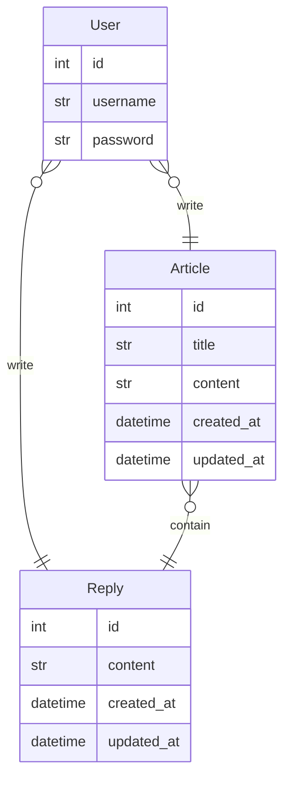

# Python Web Framework 탐구
- 같은 기능을 서로 다른 Python Web Framework로 구현하는 프로젝트입니다.
- 같은 DB, API를 바탕으로 제작되었습니다.

### 프로젝트 구현 목록
1. [Django + DRF(serializer)](django-DRF/README.md)
    - DRF의 serialzier를 사용하는 일반적인 프로젝트입니다.
2. [Django + DRF(pydantic)](django-pydantic/README.md)
    - DRF의 serialzier대신 pydantic을 활용해보는 프로젝트입니다.
3. Django + django-ninja
    - DRF대신 django-ninja를 활용하는 프로젝트입니다.
4. [FasAPI](FastAPI/README.md)
    - FastAPI, Pydantic, SQLAlchempy를 활용한 프로젝트입니다.

---
# 설계
### ERD

- Article - title : string(20)
- Reply - content : string(20)

### API

#### Articles
- `articles/` GET 전체 게시글 목록
- `articles/` POST 게시글 작성
- `articles/<article_id>/` GET 특정 게시글 조회
