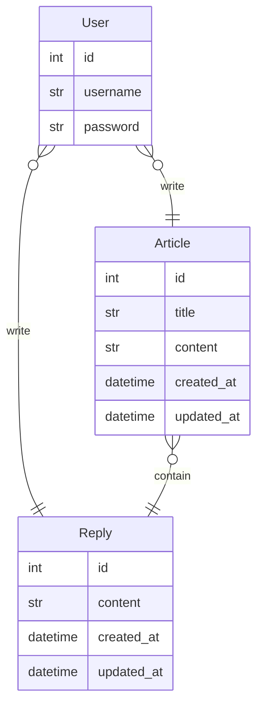

# 같은 기능을 서로 다른 Python Web Framework로 구현하는 프로젝트입니다.
- 같은 DB, API를 바탕으로 제작되었습니다

1. Django + DRF(serializer)
2. Django + DRF(pydantic)
3. Django + django-ninja
4. FasAPI

---
# ERD

- Article - title : string(20)
- Reply - content : string(20)

# API

## Articles
- `articles/` GET 전체 게시글 목록
- `articles/` POST 전체 게시글 목록
- `articles/<article_id>/` GET 특정 게시글 조회
